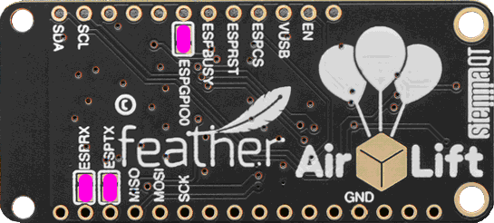
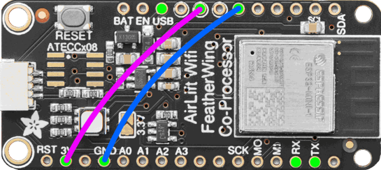

# Installing Blynk.NCP on AirLift FeatherWing

## Prerequisites

Hardware:

- [Adafruit AirLift FeatherWing](https://www.adafruit.com/product/4264) (ESP32)
- USB to TTL Serial (3.3v) adapter or cable
- Solderless Breadboard (optional)
- Jumper wires
- Soldering iron and accessories (read more [about soldering](https://learn.adafruit.com/adafruit-guide-excellent-soldering/tools))

Software:

- Espressif [esptool](https://docs.espressif.com/projects/esptool/en/)
- Blynk.NCP firmware binary: [BlynkNCP_generic_esp32_4M.flash.bin](https://github.com/blynkkk/BlynkNcpDriver/releases/latest/download/BlynkNCP_generic_esp32_4M.flash.bin)

## Assemble the shield

1. Solder the [Feather header pins](https://learn.adafruit.com/adafruit-airlift-featherwing-esp32-wifi-co-processor-featherwing/assembly-2)
2. Bridge the `ESPTX`, `ESPRX`, and `ESPGPIO0` jumper pads (using a small amount of solder)



## Connect the TTL Serial adapter or cable

| AirLift   | TTL adapter
| :---      | :---
| GND       | GND
| VUSB      | 5V
| ESPRST    | 3v3
| ESPTX     | RX
| ESPRX     | TX
| ESPGPIO0  | GND

> [!TIP]
> Utilize a solderless breadboard along with jumper wires for a more straightforward connection process



## Flash Blynk.NCP firmware

```sh
esptool.py --baud 460800 --before default_reset --after hard_reset write_flash --flash_size detect --erase-all 0x0 BlynkNCP_generic_esp32_4M.flash.bin
```

<details><summary><b>Expected esptool output</b></summary>

```log
TODO
```

</details>

## Verify

1. Use your favorite serial terminal software (`PuTTY`, `minicom`, `screen`) to access the TTL serial console (`38400 8N1`).
2. **Important:** Disconnect the `G0` from `GND`.
3. Power-cycle the shield by reconnecting the 5V supply and wait a few seconds.
4. The serial monitor should display:

    ```log
    [rpc port] Blynk.NCP started
    Version: x.x.x, Build: (date and time)
    ```

## Finish

Disconnect all the wires and adapters from the shield.

> [!NOTE]
> You may also want to disconnect `ESPGPIO0` jumper pads. You can do it now by removing the solder bridge.

