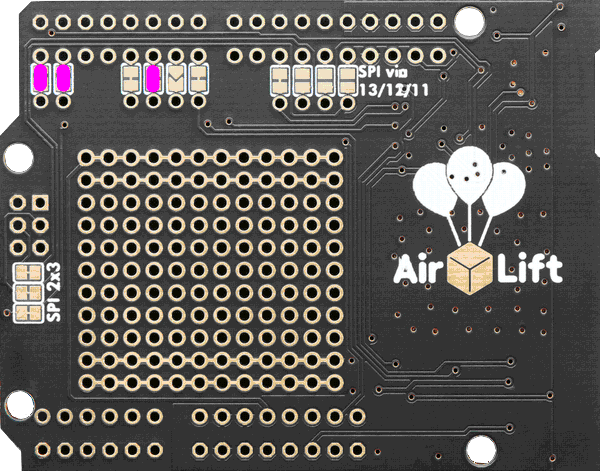
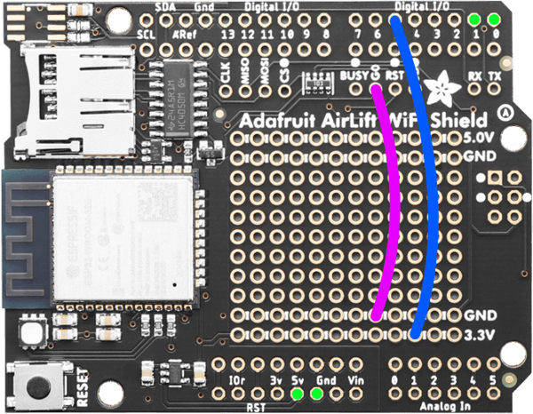

# Installing Blynk.NCP on AirLift Shield

## Prerequisites

Hardware:

- [Adafruit AirLift Shield](https://www.adafruit.com/product/4285) (ESP32)
- USB to TTL Serial (3.3v) adapter or cable
- Jumper wires
- Soldering iron and accessories (read more [about soldering](https://learn.adafruit.com/adafruit-guide-excellent-soldering/tools))

Software:

- Espressif [esptool](https://docs.espressif.com/projects/esptool/en/)
- Blynk.NCP firmware binary: [BlynkNCP_generic_esp32_4M.flash.bin](https://github.com/blynkkk/BlynkNcpDriver/releases/latest/download/BlynkNCP_generic_esp32_4M.flash.bin)

## Assemble the shield

1. Solder the [Arduino header pins](https://learn.adafruit.com/adafruit-airlift-shield-esp32-wifi-co-processor/assembly-2) (the 2x3 ISP header is not needed)
2. Bridge the `TX(0)`, `RX(1)`, and `RST(5)` jumper pads (using small amount of solder)



## Connect the TTL Serial adapter or cable

| AirLift   | TTL adapter
| :---      | :---
| GND       | GND
| 5V        | 5V
| D5(RST)   | 3v3
| D0(TX)    | RX
| D1(RX)    | TX
| G0        | GND

> [!TIP]
> Utilize the prototyping area along with jumper wires for a more straightforward connection process



## Flash Blynk.NCP firmware

```sh
esptool.py --baud 460800 --before default_reset --after hard_reset write_flash --flash_size detect --erase-all 0x0 BlynkNCP_generic_esp32_4M.flash.bin
```

<details><summary><b>Expected esptool output</b></summary>

```log
esptool.py v4.5.1
Found 1 serial ports
Serial port /dev/ttyUSB0
Connecting.........
Detecting chip type... Unsupported detection protocol, switching and trying again...
Connecting....
Detecting chip type... ESP32
Chip is ESP32-D0WD (revision v1.0)
Features: WiFi, BT, Dual Core, 240MHz, VRef calibration in efuse, Coding Scheme None
Crystal is 40MHz
MAC: b4:e6:2d:xx:xx:xx
Uploading stub...
Running stub...
Stub running...
Changing baud rate to 460800
Changed.
Configuring flash size...
Auto-detected Flash size: 4MB
Erasing flash (this may take a while)...
Chip erase completed successfully in 9.2s
Compressed 1338368 bytes to 832842...
Writing at 0x00000000... (1 %)
Writing at 0x000115a2... (3 %)
...
Writing at 0x0013c5c1... (98 %)
Writing at 0x00141b66... (100 %)
Wrote 1338368 bytes (832842 compressed) at 0x00000000 in 20.0 seconds (effective 536.3 kbit/s)...
Hash of data verified.

Leaving...
Hard resetting via RTS pin...
```

</details>

## Verify

1. Use your favorite serial terminal software (`PuTTY`, `minicom`, `screen`) to access the TTL serial console (`38400 8N1`).
2. **Important:** Disconnect the `G0` from `GND`.
3. Power-cycle the shield by reconnecting the 5V supply and wait a few seconds.
4. The serial monitor should display:

    ```log
    [rpc port] Blynk.NCP started
    Version: x.x.x, Build: (date and time)
    ```

## Finish

Disconnect all the wires and adapters from the shield.

