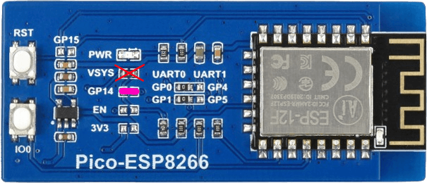
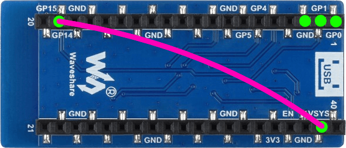

# Installing Blynk.NCP on Pico-ESP8266 shield

## Prerequisites

Hardware:

- [Pico-ESP8266 shield](https://www.waveshare.com/pico-esp8266.htm)
- USB to TTL Serial (3.3v) adapter or cable
- Jumper wires
- Soldering iron and accessories (read more [about soldering](https://learn.adafruit.com/adafruit-guide-excellent-soldering/tools))

Software:

- Espressif [esptool](https://docs.espressif.com/projects/esptool/en/)
- Blynk.NCP firmware binary: [BlynkNCP_generic_esp8266_4M.flash.bin](https://github.com/blynkkk/BlynkNcpDriver/releases/latest/download/BlynkNCP_generic_esp8266_4M.flash.bin)

## Assemble the shield

It is recommended to route the `VCC_EN` of the voltage regulator to the GPIO header:

1. Remove the `0R` resistor labeled `VSYS`
2. Place the same resistor on `GP14` pads (or just create a solder bridge)



> [!TIP]
> Alternatively (depending on you application) you may want to route the ESP8266 `REST` pin to `GP15`.
> Check out the [schematic](https://files.waveshare.com/upload/7/74/Pico-ESP8266_Schematic.pdf) for details.

## Connect the TTL Serial adapter or cable

| Shield    | TTL adapter
| :---      | :---
| GND       | GND
| VSYS      | 5V
| GP14(EN)  | 3v3 or 5V
| GP1(TX)   | RX
| GP0(RX)   | TX



## Flash Blynk.NCP firmware

1. Press and hold the `IO0` button
2. Press `RST` button shortly
3. Release the `IO0` button
4. Run this command:

```sh
esptool.py --baud 460800 --before default_reset --after hard_reset write_flash --flash_size detect --erase-all 0x0 BlynkNCP_generic_esp8266_4M.flash.bin
```

<details><summary><b>Expected esptool output</b></summary>

```log
esptool.py v4.6.2
Serial port /dev/ttyUSB1
Connecting....
Detecting chip type... ESP8266
Chip is ESP8266EX
Features: WiFi
Crystal is 26MHz
MAC: 4c:75:25:xx:xx:xx
Uploading stub...
Running stub...
Stub running...
Changing baud rate to 460800
Changed.
Configuring flash size...
Auto-detected Flash size: 4MB
Erasing flash (this may take a while)...
Chip erase completed successfully in 9.8s
Compressed 515296 bytes to 372588...
Wrote 515296 bytes (372588 compressed) at 0x00000000 in 8.4 seconds (effective 490.8 kbit/s)...
Hash of data verified.

Leaving...
Hard resetting via RTS pin...
```

</details>

## Verify

1. Use your favourite serial terminal software (`PuTTY`, `minicom`, `screen`) to access the TTL serial console (`38400 8N1`).
2. Press the `RST` button and wait a few seconds.
3. The serial monitor should display:

    ```log
    [rpc port] Blynk.NCP started
    Version: x.x.x, Build: (date and time)
    ```

## Finish

Disconnect all the wires and adapters from the shield.

