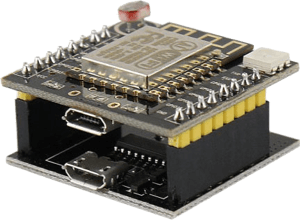

# Installing Blynk.NCP on Witty Cloud

## Prerequisites

Hardware:

- Witty Cloud (ESP8266)
- Micro-USB cable

Software:

- Espressif [esptool](https://docs.espressif.com/projects/esptool/en/)
- Blynk.NCP firmware binary: [BlynkNCP_generic_esp8266_4M.flash.bin](https://github.com/blynkkk/BlynkNcpDriver/releases/latest/download/BlynkNCP_generic_esp8266_4M.flash.bin)

## Flash Blynk.NCP firmware



1. Assemble the Witty Cloud board (insert the top part into the bottom part)
2. Connect the board to your PC **using the bottom USB port**

Run this command:

```sh
esptool.py --baud 460800 --before default_reset --after hard_reset write_flash --flash_size detect --erase-all 0x0 BlynkNCP_generic_esp8266_4M.flash.bin
```

<details><summary><b>Expected esptool output</b></summary>

```log
esptool.py v4.6.2
Serial port /dev/ttyUSB1
Connecting....
Detecting chip type... ESP8266
Chip is ESP8266EX
Features: WiFi
Crystal is 26MHz
MAC: 4c:75:25:xx:xx:xx
Uploading stub...
Running stub...
Stub running...
Changing baud rate to 460800
Changed.
Configuring flash size...
Auto-detected Flash size: 4MB
Erasing flash (this may take a while)...
Chip erase completed successfully in 9.8s
Compressed 515296 bytes to 372588...
Wrote 515296 bytes (372588 compressed) at 0x00000000 in 8.4 seconds (effective 490.8 kbit/s)...
Hash of data verified.

Leaving...
Hard resetting via RTS pin...
```

</details>

## Verify

1. Re-connect the USB cable.
2. Use your favorite serial terminal software (`PuTTY`, `minicom`, `screen`) to access the TTL serial console (`38400 8N1`).
3. Press the `RST` button on the Witty Cloud and wait a few seconds.
4. The serial monitor should display:

    ```log
    [rpc port] Blynk.NCP started
    Version: x.x.x, Build: (date and time)
    ```

## Finish

1. Disconnect the USB cable from Witty Cloud.
2. Detach the top and bottom parts.
3. Use **the top part of Witty Cloud** as your Network Co-Processor.

