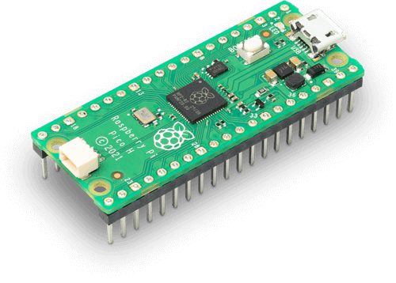

# Raspberry Pi Pico + Pico-ESP8266 Shield



## Prerequisites

Hardware:

- Raspberry Pi Pico (RP2040)
- Pico-ESP8266 Shield (ESP32) to act as a **Network Co-Processor**
- Micro-USB cable
- External Debugger (JLink/PicoProbe)

Software:

- Latest official [Zephyr sources and SDK][zephyr_sdk]
- Blynk.NCP [firmware binary][blynk_ncp_binary] (more on that later)

## Configure and build the sample project

```sh
git clone https://github.com/Blynk-Technologies/BlynkNcpExample_Zephyr
cd BlynkNcpExample_Zephyr
git submodule update --init --recursive
```

Fill in [the information from your Blynk Template](https://bit.ly/BlynkInject):

```sh
cd samples/basic
echo 'CONFIG_BLYNK_TEMPLATE_ID="TMPxxxxxxxxx"' >> prj.conf
echo 'CONFIG_BLYNK_TEMPLATE_NAME="OurProduct"' >> prj.conf
```

Build:

```sh
export ZEPHYR_BASE=~/zephyrproject/zephyr
./build.sh rpi_pico
```

<details><summary><b>Expected output</b></summary>

```log
...
...
[158/159] Linking C executable zephyr/zephyr.elf
Memory region         Used Size  Region Size  %age Used
           FLASH:       52388 B     907904 B      5.77%
             RAM:       24768 B       264 KB      9.16%
        IDT_LIST:          0 GB         2 KB      0.00%
Generating files from build/basic/zephyr/zephyr.elf for board: rpi_pico
image.py: sign the payload
image.py: sign the payload
image.py: sign the payload
image.py: sign the payload
...
[14/271] Performing build step for 'second_stage_bootloader'
[1/2] Building ASM object CMakeFiles/boot_stage2.dir/home/user/zephyrproject/modules/hal/rpi_pico/src/rp2_common/boot_stage2/boot2_w25q080.S.obj
[2/2] Linking ASM executable boot_stage2
[270/271] Linking C executable zephyr/zephyr.elf
Memory region         Used Size  Region Size  %age Used
      BOOT_FLASH:         256 B        256 B    100.00%
           FLASH:       27802 B      65280 B     42.59%
             RAM:       24832 B       264 KB      9.19%
        IDT_LIST:          0 GB         2 KB      0.00%
Generating files from build/mcuboot/zephyr/zephyr.elf for board: rpi_pico
Converting to uf2, output size: 56320, start address: 0x10000000
Wrote 56320 bytes to zephyr.uf2
[271/271] cd ....../build/mcuboot/zephyr/zephyr.elf
[16/16] Completed 'mcuboot'
```

</details>

## Flash the board

> [!NOTE]
> You will need an external programmer like `Segger JLink` or `PicoProbe`.
> We were unable to flash the board properly using miltiple `UF2` files (one for MCUboot and one for the main firmware).
> Read more about [flashing the Pi Pico with Zephyr](https://docs.zephyrproject.org/latest/boards/arm/rpi_pico/doc/index.html#flashing)

```sh
# Flash MCUboot and the sample firmware
west flash --runner jlink
```

## Flash the Network Co-Processor

👉 Follow the detailed [Pico-ESP8266 flashing guide](../../flashing_ncp/Pico_ESP8266.md)

## Assemble the board and verify

> [!WARNING]
> When assembling the board, ensure that all USB ports are disconnected from any components, and that there is no power supply connected.

1. Connect Pico-ESP8266 shield to the Raspberry Pi Pico.  
   **Important**: The silkscreened USB port representation on the shield should be properly aligned with the actual USB port on the Raspberry Pi Pico.
2. Connect your device using USB. The device will appear as a `CDC-ACM` serial.
3. Use your favourite serial terminal software (`PuTTY`, `minicom`, `screen`) to access the serial console (`115200 8N1`).
4. The expected serial monitor output looks like this:

    ```log
    *** Booting Zephyr OS build zephyr-v3.5.0-3889-ge49d174be910 ***
    [00:00:03.002,000] <inf> blynk_example: Blynk.NCP host example
    [00:00:03.002,000] <inf> blynk_example: Firmware version: 0.0.1
    [00:00:03.854,000] <inf> blynk_ncp: Blynk.NCP ready br 38400
    [00:00:03.854,000] <inf> blynk_ncp: setting target br 115200
    [00:00:03.883,000] <inf> blynk_ncp: Blynk.NCP ready br 115200
    [00:00:03.886,000] <inf> blynk_ncp: NCP firmware: 0.6.3
    [00:00:03.903,000] <inf> blynk_ncp: NCP state changed [Not Initialized] => [Configuration]
    ```

## Use the Blynk iOS/Android app to configure your new device

Ensure that the Blynk App is installed on your smartphone.

Open the `Blynk App` -> click `Add New Device` -> select `Find Devices Nearby`


## Next steps

- Use [**Blynk.Air**](https://docs.blynk.io/en/blynk.console/blynk.air) to peform OTA update of your device firmware
  - The firmware file can be found here: **`./build/basic/zephyr/zephyr.signed.bin`**
- Learn about [Zephyr firmware signing](https://docs.zephyrproject.org/latest/develop/west/sign.html)
- Use `west build -t menuconfig` to explore the available settings

## Troubleshooting

Check out the [troubleshooting guide](../../Troubleshooting.md)

## Disclaimer

> The community edition of Blynk.NCP is available for personal use and evaluation.
If you're interested in using Blynk.NCP for commercial applications, feel free to [contact Blynk][blynk_sales]. Thank you!

[zephyr_sdk]: https://docs.zephyrproject.org/latest/develop/getting_started/index.html
[blynk_ncp_binary]: https://docs.blynk.io/en/blynk.ncp/supported-connectivity-modules
[blynk_sales]: https://blynk.io/en/contact-us-business

