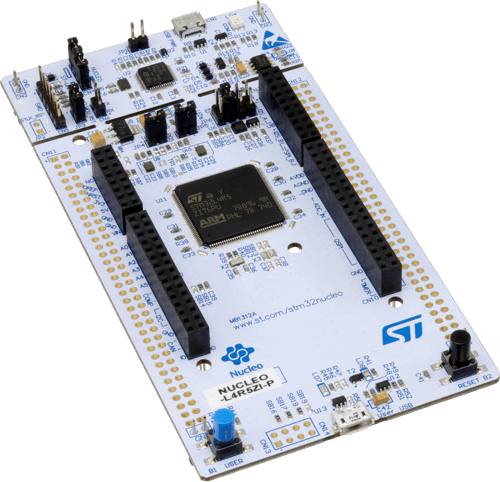

# ST Nucleo L4R5ZI + Adafruit AirLift Shield



## Prerequisites

Hardware:

- ST Nucleo STM32L4R5ZI
- Adafruit AirLift Shield (ESP32) to act as a **Network Co-Processor**
- USB to TTL Serial (3.3v) adapter or cable
- Micro-USB cable

Software:

- Latest official [Zephyr sources and SDK][zephyr_sdk]
- Blynk.NCP [firmware binary][blynk_ncp_binary] (more on that later)

## Configure and build the sample project

```sh
git clone https://github.com/Blynk-Technologies/BlynkNcpExample_Zephyr
cd BlynkNcpExample_Zephyr
git submodule update --init --recursive
```

Fill in [the information from your Blynk Template](https://bit.ly/BlynkInject):

```sh
cd samples/basic
echo 'CONFIG_BLYNK_TEMPLATE_ID="TMPxxxxxxxxx"' >> prj.conf
echo 'CONFIG_BLYNK_TEMPLATE_NAME="OurProduct"' >> prj.conf
```

Build:

```sh
export ZEPHYR_BASE=~/zephyrproject/zephyr
./build.sh nucleo_l4r5zi
```

<details><summary><b>Expected output</b></summary>

```log
...
...
[153/154] Linking C executable zephyr/zephyr.elf
Memory region         Used Size  Region Size  %age Used
           FLASH:       44812 B       252 KB     17.37%
             RAM:       17344 B       640 KB      2.65%
        IDT_LIST:          0 GB         2 KB      0.00%
Generating files from build/basic/zephyr/zephyr.elf for board: nucleo_l4r5zi
image.py: sign the payload
image.py: sign the payload
image.py: sign the payload
image.py: sign the payload
[154/154] cd ....../build/basic/zephyr/zephyr.elf
[11/16] Performing build step for 'mcuboot'
[1/266] Preparing syscall dependency handling

[4/266] Generating include/generated/version.h
-- Zephyr version: 3.5.99 (/home/user/zephyrproject/zephyr), build: zephyr-v3.5.0-3889-ge49d174be910
[265/266] Linking C executable zephyr/zephyr.elf
Memory region         Used Size  Region Size  %age Used
           FLASH:       28244 B       128 KB     21.55%
             RAM:       18112 B       640 KB      2.76%
        IDT_LIST:          0 GB         2 KB      0.00%
Generating files from build/mcuboot/zephyr/zephyr.elf for board: nucleo_l4r5zi
[266/266] cd ....../build/mcuboot/zephyr/zephyr.elf
[16/16] Completed 'mcuboot'
```

</details>

## Flash the board

Use USB cable to connect the board to your PC (use the on-board ST-LINK port).

```sh
# Flash MCUboot and the sample
west flash --runner openocd
```

## Flash the Network Co-Processor

👉 Follow the detailed [AirLift Shield flashing guide](../../flashing_ncp/Adafruit_AirLift_Shield.md)

## Assemble the board and verify

> [!WARNING]
> When assembling the board, ensure that all USB ports are disconnected from any components, and that there is no power supply connected.

1. Connect AirLift Shield to the ST Morpho header of the Nucleo board.
2. Connect USB to TTL Serial adapter to the Nucleo:

    | Nucleo    | TTL adapter
    | :---      | :---
    | GND       | GND
    | PA2(TX)   | RX
    | PA3(RX)   | TX

3. Use your favourite serial terminal software (`PuTTY`, `minicom`, `screen`) to access the serial console (`115200 8N1`).
4. Press `Reset` button on the Nucleo
5. The expected serial monitor output looks like this:

    ```log
    *** Booting Zephyr OS build zephyr-v3.5.0-3889-ge49d174be910 ***
    [00:00:03.002,000] <inf> blynk_example: Blynk.NCP host example
    [00:00:03.002,000] <inf> blynk_example: Firmware version: 0.0.1
    [00:00:03.854,000] <inf> blynk_ncp: Blynk.NCP ready br 38400
    [00:00:03.854,000] <inf> blynk_ncp: setting target br 115200
    [00:00:03.883,000] <inf> blynk_ncp: Blynk.NCP ready br 115200
    [00:00:03.886,000] <inf> blynk_ncp: NCP firmware: 0.6.3
    [00:00:03.903,000] <inf> blynk_ncp: NCP state changed [Not Initialized] => [Configuration]
    ```

## Use the Blynk iOS/Android app to configure your new device

Ensure that the Blynk App is installed on your smartphone.

Open the `Blynk App` -> click `Add New Device` -> select `Find Devices Nearby`


## Next steps

- Use [**Blynk.Air**](https://docs.blynk.io/en/blynk.console/blynk.air) to peform OTA update of your device firmware
  - The firmware file can be found here: **`./build/basic/zephyr/zephyr.signed.bin`**
- Learn about [Zephyr firmware signing](https://docs.zephyrproject.org/latest/develop/west/sign.html)
- Use `west build -t menuconfig` to explore the available settings

## Troubleshooting

Check out the [troubleshooting guide](../../Troubleshooting.md)

## Disclaimer

> The community edition of Blynk.NCP is available for personal use and evaluation.
If you're interested in using Blynk.NCP for commercial applications, feel free to [contact Blynk][blynk_sales]. Thank you!

[zephyr_sdk]: https://docs.zephyrproject.org/latest/develop/getting_started/index.html
[blynk_ncp_binary]: https://docs.blynk.io/en/blynk.ncp/supported-connectivity-modules
[blynk_sales]: https://blynk.io/en/contact-us-business

