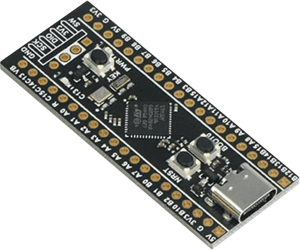

# WeAct Black Pill F411CE + Witty Cloud



## Prerequisites

Hardware:

- WeAct Black Pill V2.0 (STM32F411CE)
- Witty Cloud board (ESP8266) to act as a **Network Co-Processor**
- Breadboard and jumper wires
- USB Type C cable

Software:

- Latest official [Zephyr sources and SDK][zephyr_sdk]
- Blynk.NCP [firmware binary][blynk_ncp_binary] (more on that later)

## Configure and build the sample project

```sh
git clone https://github.com/Blynk-Technologies/BlynkNcpExample_Zephyr
cd BlynkNcpExample_Zephyr
git submodule update --init --recursive
```

Fill in [the information from your Blynk Template](https://bit.ly/BlynkInject):

```
cd samples/basic
echo 'CONFIG_BLYNK_TEMPLATE_ID="TMPxxxxxxxxx"' >> prj.conf
echo 'CONFIG_BLYNK_TEMPLATE_NAME="OurProduct"' >> prj.conf
```

Build:

```sh
export ZEPHYR_BASE=~/zephyrproject/zephyr
./build.sh blackpill_f411ce
```

<details><summary><b>Expected output</b></summary>

```log
...
...
[168/169] Linking C executable zephyr/zephyr.elf
Memory region         Used Size  Region Size  %age Used
           FLASH:       59216 B     121472 B     48.75%
             RAM:       23360 B       128 KB     17.82%
        IDT_LIST:          0 GB         2 KB      0.00%
Generating files from build/basic/zephyr/zephyr.elf for board: blackpill_f411ce
image.py: sign the payload
image.py: sign the payload
image.py: sign the payload
image.py: sign the payload
[169/169] cd build/basic/zephyr && /ho...elf-file=build/basic/zephyr/zephyr.elf
[11/16] Performing build step for 'mcuboot'
[1/268] Preparing syscall dependency handling

[3/268] Generating include/generated/version.h
-- Zephyr version: 3.5.99 (/home/vshymanskyy/zephyrproject/zephyr), build: zephyr-v3.5.0-3603-g603c3af895b0
[267/268] Linking C executable zephyr/zephyr.elf
Memory region         Used Size  Region Size  %age Used
           FLASH:       27822 B        32 KB     84.91%
             RAM:       24256 B       128 KB     18.51%
        IDT_LIST:          0 GB         2 KB      0.00%
Generating files from build/mcuboot/zephyr/zephyr.elf for board: blackpill_f411ce
[268/268] cd build/mcuboot/zephyr && /...f-file=build/mcuboot/zephyr/zephyr.elf
[16/16] Completed 'mcuboot'
```

</details>

## Flash the board

Use USB-C cable to connect the board to your PC.
To flash it, you need to hold the `BOOT0` button, and press `NRST` shortly (you will need to repeat this two times).

```sh
# Flash MCUboot
west flash --build-dir build/mcuboot
# Flash sample
west flash --build-dir build/basic
```

## Flash the Network Co-Processor

👉 Follow the detailed [Witty Cloud flashing guide](../../flashing_ncp/Witty_Cloud.md)

## Assemble the board and verify

> [!WARNING]
> When assembling the board, ensure that all USB ports are disconnected from any components, and that there is no power supply connected.

1. Use the solderless breadborad to connect your MCU to the NCP:

    | Main    | Witty
    | ---     | ---
    | 5V      | VCC
    | G(GND)  | GND
    | A2(RX)  | TXD
    | A3(TX)  | RXD
    | A5(RST) | REST

    

2. Connect your device using USB. The device will appear as a `CDC-ACM` serial.
3. Use your favourite serial terminal software (`PuTTY`, `minicom`, `screen`) to access the serial console (`115200 8N1`).
4. The expected serial monitor output looks like this:

    ```log
    *** Booting Zephyr OS build zephyr-v3.5.0-3889-ge49d174be910 ***
    [00:00:03.002,000] <inf> blynk_example: Blynk.NCP host example
    [00:00:03.002,000] <inf> blynk_example: Firmware version: 0.0.1
    [00:00:03.854,000] <inf> blynk_lib: Blynk.NCP ready br 38400
    [00:00:03.854,000] <inf> blynk_lib: setting target br 115200
    [00:00:03.883,000] <inf> blynk_lib: Blynk.NCP ready br 115200
    [00:00:03.886,000] <inf> blynk_lib: NCP firmware: 0.6.3
    [00:00:03.903,000] <inf> blynk_lib: NCP state changed [Not Initialized] => [Configuration]
    ```

## Use the Blynk iOS/Android app to configure your new device

Ensure that the Blynk App is installed on your smartphone.

Open the `Blynk App` -> click `Add New Device` -> select `Find Devices Nearby`


## Next steps

- Use [**Blynk.Air**](https://docs.blynk.io/en/blynk.console/blynk.air) to peform OTA update of your device firmware
  - The firmware file can be found here: **`./build/basic/zephyr/zephyr.signed.bin`**
- Learn about [Zephyr firmware signing](https://docs.zephyrproject.org/latest/develop/west/sign.html)
- Use `west build -t menuconfig` to explore the available settings

## Troubleshooting

Check out the [troubleshooting guide](../../Troubleshooting.md)

## Disclaimer

> The community edition of Blynk.NCP is available for personal use and evaluation.
If you're interested in using Blynk.NCP for commercial applications, feel free to [contact Blynk][blynk_sales]. Thank you!

[zephyr_sdk]: https://docs.zephyrproject.org/latest/develop/getting_started/index.html
[blynk_ncp_binary]: https://docs.blynk.io/en/blynk.ncp/supported-connectivity-modules
[blynk_sales]: https://blynk.io/en/contact-us-business

