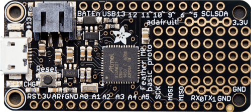

# Adafruit Feather M0 Basic Proto + AirLift FeatherWing



> [!NOTE]
> This board is currently not supported by MCUboot on Zephyr,
> so OTA firmware updates using **Blynk.Air** won't work out of the box.
> However, it will work when [this change](https://github.com/zephyrproject-rtos/zephyr/pull/67275) is accepted in Zephyr. This sample will be updated accordingly).

## Prerequisites

Hardware:

- Adafruit Feather M0 Basic Proto (ATSAMD21G18A)
- Adafruit AirLift FeatherWing (ESP32) to act as a **Network Co-Processor**
- Micro-USB cable

Software:

- Latest official [Zephyr sources and SDK][zephyr_sdk]
- Blynk.NCP [firmware binary][blynk_ncp_binary] (more on that later)

## Configure and build the sample project

```sh
git clone https://github.com/Blynk-Technologies/BlynkNcpExample_Zephyr
cd BlynkNcpExample_Zephyr
git submodule update --init --recursive
```

Fill in [the information from your Blynk Template](https://bit.ly/BlynkInject):

```
cd samples/without_ota
echo 'CONFIG_BLYNK_TEMPLATE_ID="TMPxxxxxxxxx"' >> prj.conf
echo 'CONFIG_BLYNK_TEMPLATE_NAME="OurProduct"' >> prj.conf
```

Build:

```sh
export ZEPHYR_BASE=~/zephyrproject/zephyr
./build.sh adafruit_feather_m0_basic_proto
```

<details><summary><b>Expected output</b></summary>

```log
...
...
[138/139] Linking C executable zephyr/zephyr.elf
Memory region         Used Size  Region Size  %age Used
           FLASH:       41324 B       232 KB     17.39%
             RAM:       20864 B        32 KB     63.67%
        IDT_LIST:          0 GB         2 KB      0.00%
Generating files from /data/_Business/BlynkNcpExample_Zephyr/samples/without_ota/build/zephyr/zephyr.elf for board: adafruit_feather_m0_basic_proto
[139/139] cd /data/_Business/BlynkNcpExample_Zephy...Zephyr/samples/without_ota/build/zephyr/zephyr.elf
```

</details>

## Flash the board

To flash Feather M0 Basic, you need to connect your board using USB, and double-click the `Reset` button. The red LED will start fading in and out slowly. Then run:

```sh
west flash
```

## Flash the Network Co-Processor

👉 Follow the detailed [AirLift FeatherWing flashing guide](../../flashing_ncp/Adafruit_AirLift_FeatherWing.md)

## Assemble the board and verify

> [!WARNING]
> When assembling the board, ensure that all USB ports are disconnected from any components, and that there is no power supply connected.

1. Insert AirLift FeatherWing shield into the Feather board.
2. Connect your device using USB. The device will appear as a `CDC-ACM` serial.
3. Use your favourite serial terminal software (`PuTTY`, `minicom`, `screen`) to access the serial console (`115200 8N1`).
4. The expected serial monitor output looks like this:

    ```log
    *** Booting Zephyr OS build zephyr-v3.5.0-3889-ge49d174be910 ***
    [00:00:03.002,000] <inf> blynk_example: Blynk.NCP host example
    [00:00:03.002,000] <inf> blynk_example: Firmware version: 0.0.1
    [00:00:03.854,000] <inf> blynk_ncp: Blynk.NCP ready br 38400
    [00:00:03.854,000] <inf> blynk_ncp: setting target br 115200
    [00:00:03.883,000] <inf> blynk_ncp: Blynk.NCP ready br 115200
    [00:00:03.886,000] <inf> blynk_ncp: NCP firmware: 0.6.3
    [00:00:03.903,000] <inf> blynk_ncp: NCP state changed [Not Initialized] => [Configuration]
    ```

## Use the Blynk iOS/Android app to configure your new device

Ensure that the Blynk App is installed on your smartphone.

Open the `Blynk App` -> click `Add New Device` -> select `Find Devices Nearby`


## Next steps

- Use [**Blynk.Air**](https://docs.blynk.io/en/blynk.console/blynk.air) to peform OTA update of your device firmware
  - The firmware file can be found here: **`./build/basic/zephyr/zephyr.signed.bin`**
- Learn about [Zephyr firmware signing](https://docs.zephyrproject.org/latest/develop/west/sign.html)
- Use `west build -t menuconfig` to explore the available settings

## Troubleshooting

Check out the [troubleshooting guide](../../Troubleshooting.md)

## Disclaimer

> The community edition of Blynk.NCP is available for personal use and evaluation.
If you're interested in using Blynk.NCP for commercial applications, feel free to [contact Blynk][blynk_sales]. Thank you!

[zephyr_sdk]: https://docs.zephyrproject.org/latest/develop/getting_started/index.html
[blynk_ncp_binary]: https://docs.blynk.io/en/blynk.ncp/supported-connectivity-modules
[blynk_sales]: https://blynk.io/en/contact-us-business

