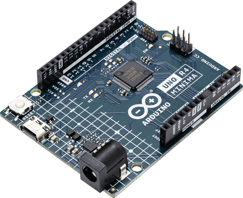

# Arduino UNO R4 Minima + AirLift Shield

> [!CAUTION]
> 🚧 This sample is **Work-In-Progress** and is not fully functional yet. 🚧



> [!NOTE]
> This board is currently not supported by MCUboot on Zephyr,
> so OTA firmware updates using **Blynk.Air** won't work out of the box.

## Prerequisites

Hardware:

- Arduino UNO R4 Minima (Renesas RA4M1)
- Adafruit AirLift Shield (ESP32) to act as a **Network Co-Processor**
- USB Type C cable

Software:

- Latest official [Zephyr sources and SDK][zephyr_sdk]
- Blynk.NCP [firmware binary][blynk_ncp_binary] (more on that later)

## Configure and build the sample project

```sh
git clone https://github.com/Blynk-Technologies/BlynkNcpExample_Zephyr
cd BlynkNcpExample_Zephyr
git submodule update --init --recursive
```

Fill in [the information from your Blynk Template](https://bit.ly/BlynkInject):

```sh
cd samples/without_ota
echo 'CONFIG_BLYNK_TEMPLATE_ID="TMPxxxxxxxxx"' >> prj.conf
echo 'CONFIG_BLYNK_TEMPLATE_NAME="OurProduct"' >> prj.conf
```

Build:

```sh
export ZEPHYR_BASE=~/zephyrproject/zephyr
./build.sh arduino_uno_r4_minima
```

<details><summary><b>Expected output</b></summary>

```log
...
...
[123/124] Linking C executable zephyr/zephyr.elf
Memory region         Used Size  Region Size  %age Used
           FLASH:       29708 B       240 KB     12.09%
             RAM:       16744 B        32 KB     51.10%
        IDT_LIST:          0 GB         2 KB      0.00%
Generating files from build/zephyr/zephyr.elf for board: arduino_uno_r4_minima
[124/124] cd ....../build/zephyr/zephyr.elf
```

</details>

## Flash the board

```sh
west flash
```

## Flash the Network Co-Processor

👉 Follow the detailed [AirLift Shield flashing guide](../../flashing_ncp/Adafruit_AirLift_Shield.md)

## Assemble the board and verify

> [!WARNING]
> When assembling the board, ensure that all USB ports are disconnected from any components, and that there is no power supply connected.

1. Insert AirLift Shield into the Arduino board.
2. Connect your board using the USB cable.
3. AirLift Shield should be blinking Blue LED, indicating that the board is in `Configuration` mode.

## Use the Blynk iOS/Android app to configure your new device

Ensure that the Blynk App is installed on your smartphone.

Open the `Blynk App` -> click `Add New Device` -> select `Find Devices Nearby`


## Next steps

- Use `west build -t menuconfig` to explore the available settings

## Troubleshooting

Check out the [troubleshooting guide](../../Troubleshooting.md)

## Disclaimer

> The community edition of Blynk.NCP is available for personal use and evaluation.
If you're interested in using Blynk.NCP for commercial applications, feel free to [contact Blynk][blynk_sales]. Thank you!

[zephyr_sdk]: https://docs.zephyrproject.org/latest/develop/getting_started/index.html
[blynk_ncp_binary]: https://docs.blynk.io/en/blynk.ncp/supported-connectivity-modules
[blynk_sales]: https://blynk.io/en/contact-us-business

